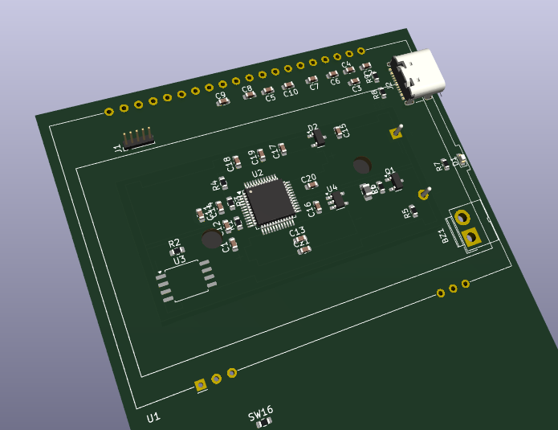

# DM50 calculator

The main features of the calculator are the following:

 - Electronic schematics and designs of the boards are open source.
 - Ultra low power ARM Cortex-M4.
 - 128-bit floating point precision implementation (IEEE 754-2008).
 - USBC port, connects as USB mass storage device.
 - 6MB of internal flash storage formatted, accesible por USB.
 - Graphic LCD Display.

# Hardware
Below is the list of electronic components used to manufacture the board.
| Component | Ref | Description |
| - | - | - |
| SoC Processor | STM32U535CBT6 | ARM Cortex-M33 ultra low power with FPU |
| Display | EA_DOGL128X-6 | STN reflective display 128x64 |
| Flash 4MB | W25Q32JVSS | 4MB Flash |
| Voltage Regulator | ADP2108AUJ-3.3 | Vin 2.3 - 5.5, Vout 3.3 |
| Power by USB (5V) | LD3985 | Micropower Low-Dropout Voltage Regulator |
| Transistor | MMBT3904L | 200 mA, 40 V NPN Bipolar Junction Transistor |

For the development of the hardware, the KiCad tool has been used.
The board can be ordered from PCBWay, JLCPCB, etc.
In addition, 3D designs for the calculator case and keyboard are included.
[pending development]

# SoCs Comparative
General comparison, taking the maximum specifications between all the SOCs of each family.

| Serie | OFF * | ON | RAM | Flash |
| - | :-: | :-: | :-: | :-: |
| STM32L4 | 8 nA | 28 μA/MHz | 320KB | 64KB - 1MB |
| STM32L4+ | 8 nA | 28 μA/MHz | 320KB | 512KB - 2MB |
| STM32L5 | 17 nA | 62 µA/MHz | 256KB | 256KB - 512KB |
| STM32U5 | 110 nA | 19 µA/MHz | 768KB | 1MB - 2MB |

(*) Power Off with backup registers without real-time clock.

# Reference hardware and software
Comparison of the hardware used in the different reference calculators:
 
| Model | Year | Processor | Speed | Precision | RAM | Flash | Display | Battery | Standby
| - | :-: | - | -: | :-: | -: | -: | - | - | -: |
| [OpenRPNCalc](https://github.com/apoluekt/OpenRPNCalc) | 2021 | STM32L476 | 8MHz | 10 | 128KB | 1MB | 400x240 | CR2032 | years |
| [NumWorks](https://www.numworks.com/resources/engineering/hardware/) | 2016 | STM32F730V8T6 | 216MHz | ? | 256KB | 6MB | 320x240 | CR2032 | years |
| [DM42](https://www.swissmicros.com/product/dm42) | 2017 | STM32L476RG | 80MHz | 34 | 128KB | 6MB | 400×240 | CR2032 | 3 years |
| [TI-Nspire CX II CAS](https://en.wikipedia.org/wiki/TI-Nspire_series#TI-Nspire_CX_II_and_TI-Nspire_CX_II_CAS) | 2013 | ARM9-26EJ-S | 396MHz | 14 | 64MB | 128MB | 320x240 | 3.7L1230SP | ? |
| [HP Prime G2](https://en.wikipedia.org/wiki/HP_Prime) | 2019 | i. MX 6ULL | 528MHz | 12 | 256MB | 512MB | 320×240 | EB-L1G6LLU | 46 days
 
Software reference (GPL):
| Software | Detail |
| - | - |
| [WP43](https://gitlab.com/rpncalculators/wp43) | Firmware for the WP43 pocket calculator (old WP43S project) |
| [C43](https://www.classic43.com) | C43 is a RPN Scientific Calculator (old WP43C project) |
| [Free42](https://github.com/thomasokken/free42) | Free42 is a software clone of the Hewlett-Packard 42S calculator |

# To Do
Main pending tasks:
1. ~~Reference hardware and software~~.
2. Hardware design. SCH & PCB. Use components supported by PCBWay and JLCPCB.
3. Memory map publication.
4. Bootloader with ability to load new firmware from FAT-USB drive.
5. 3D designs (if required).
9. New features.