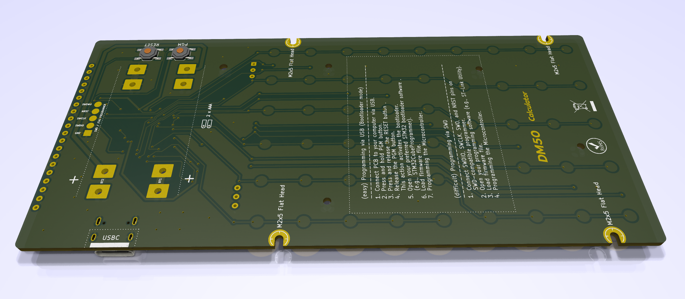
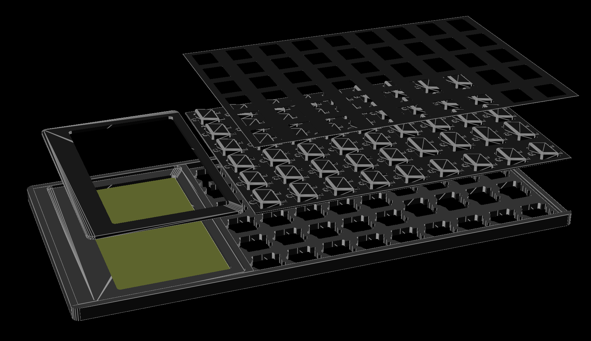
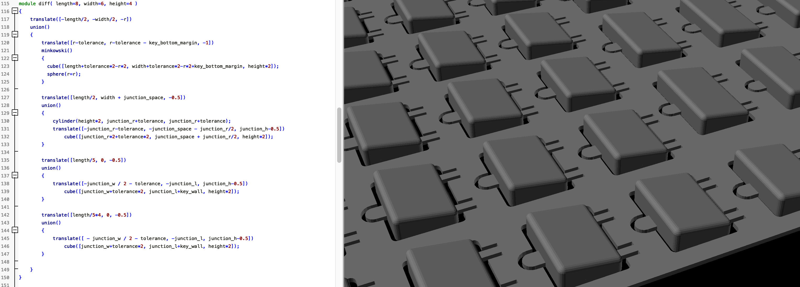
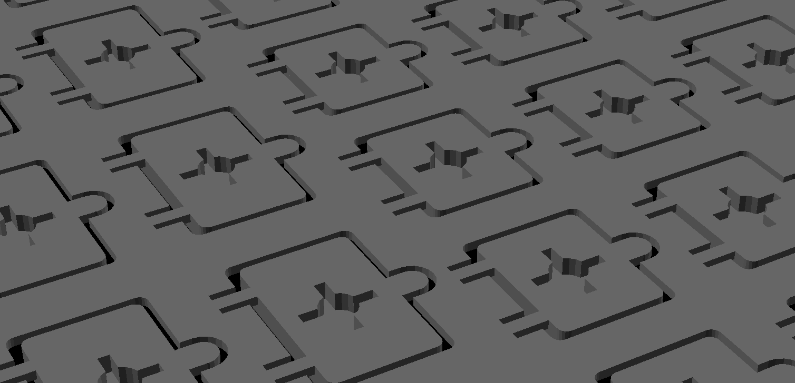

# DM50 calculator

The main features of the calculator are the following:

 - Electronic schematics and designs of the boards are open source.
 - Ultra low power ARM Cortex-M33 MCU+FPU.
 - 128-bit floating point precision implementation (IEEE 754-2008).
 - USBC port, connects as USB mass storage device.
 - 6MB flash storage, accessible via USB.
 - Graphic LCD Display.

# Hardware
Below is the list of electronic components used to manufacture the board.
| Component | Ref | Description |
| - | - | - |
| SoC Processor | STM32U535CB | ARM Cortex-M33 ultra low power with FPU |
| Display | EA_DOGL128L-6 | STN reflective display 128x64 |
| Flash 6MB | AT25SF641 | 6MB Flash |
| Voltage Regulator | ADP2108AUJ-3.3 | Vin 2.3 - 5.5, Vout 3.3 |
| Power by USB (5V) | LD3985 | Micropower Low-Dropout Voltage Regulator |
| Transistor | MMBT3904L | 200 mA, 40 V NPN Bipolar Junction Transistor |

## MCU
### STM32U535CB
This is the brain of our calculator. Ultra-low-power Arm Cortex-M33 MCU+FPU, 240 DMIPS, core clocked at 160 MHz and 274 KB of Static RAM.

[STM32U535CBT6 datasheet](docs/pdf/stm32u535cb.pdf)

## Flash memory
### AT25SF641
This is the persistant memory of our calculator. This chip stores 64 Mbit of data, and serves it over a 104 MHz Quad-SPI bus.

[AT25SF641 datasheet](docs/pdf/AT25SF641.pdf)

## Logic power supply
### ADP2108AUJ-3.3
The ADP2108 is a high efficiency, low quiescent current stepdown dc-to-dc converter.
This part regulates the voltage from the USBC input.

[ADP2108AUJ-3.3 datasheet](docs/pdf/ADP2108AUJ-3.3.pdf)

## ESD USB protection
### USBLC6-2SC6
The USB port can receive electrostatic discharges. Those very high voltage surge can permanently damage electronic components. This part evacuates the surge entering from the USB port and protects the whole circuit.

[USBLC6-2SC6 datasheet](docs/pdf/USBLC6-2SC6.pdf)

## Display
### EA_DOGL128L-6
The EA DOGL128L-6 is a 128x64-pixel graphics display. The L model does not have LED backlighting

[EA_DOGL128X-6 datasheet](docs/pdf/EA_DOGL128X-6.pdf)

## Batteries
### AAA x 2
Supports the following batteries:

| Batteries | Capacity (mha) |
| --- | :---: |
| AAA Alkaline | 900 - 1155 |
| AAA Ni-MH | 800 - 1000 |

### Battery holder
The support for AAA batteries on the PCB is XXXXXXX

# EDA Software
For the development of the hardware, the KiCad tool has been used.

[KiCad URL](https://www.kicad.org/)

# PCB Making
The board can be ordered from PCBWay, JLCPCB, etc.
In addition, 3D designs for the calculator case and keyboard are included.

# SoCs Comparative
General comparison, taking the maximum specifications between all the SOCs of each family.

| Serie | OFF * | ON | RAM | Flash |
| --- | :---: | :---: | :---: | :---: |
| STM32L4 | 8 nA | 28 μA/MHz | 320KB | 64KB - 1MB |
| STM32L4+ | 8 nA | 28 μA/MHz | 320KB | 512KB - 2MB |
| STM32L5 | 17 nA | 62 µA/MHz | 256KB | 256KB - 512KB |
| STM32U5 | 110 nA | 19 µA/MHz | 768KB | 1MB - 2MB |

(*) Power Off with backup registers without real-time clock.

## Mathematical coprocessor
The CORDIC co-processor provides hardware acceleration of certain mathematical functions, notably trigonometric, commonly used in motor control, metering, signal processing and many other applications. It speeds up the calculation of these functions compared to a software implementation, allowing a lower operating frequency, or freeing up processor cycles in order to perform other tasks.

The CORDIC main features are:

* 24-bit CORDIC rotation engine
* Circular and hyperbolic modes
* Rotation and vectoring modes
* Functions: sine, cosine, sinh, cosh, atan, atan2, atanh, modulus, square root, natural logarithm
* Programmable precision
* Low-latency AHB slave interface
* Results can be read as soon as ready without polling or interrupt
* DMA read and write channels
* Multiple register read/write by DMA

Limit: maximum precision of the coprocessor is 20 bits in the best case.

Comparative performance CORDIC versus software (math.h functions), in CPU cycles:

| Method | sin,cos | atan | exp | ln | sqrt |
| :- | -: | -: | -: | -: | -: |
| CORDIC | 29 | 33 | 39 | 27 | 23 |
| Software | 416 | 332 | 319 | 260 | 58 |

# Schematic

# PCB

# 3D PARTS

## Keyboard
The keyboard has been designed for FDM printing, with inserts in each key and post-processed with acetone.

Includes a separating piece

## Case
The design has been designed for FDM printing, with inserts in each key and post-processed with acetone.

## Serigraphy
Printing numbers on the keyboard is done using a sublimation transfer process, ordering the sheets from local companies and ironing them onto the keyboard.

## Faceplate
The front plate is printed on photographic paper and cut to size, with professional results. A photo-quality printer is recommended, such as the Epson Ecotank.

# Reference
## Hardware
Comparison of the hardware used in the different reference calculators:
 
| Year | Model | Processor | Speed | Precision | RAM | Flash | Display |
| :-: | - | - | -: | :-: | -: | -: | - |
| 2013 | [TI-Nspire CX II](https://en.wikipedia.org/wiki/TI-Nspire_series#TI-Nspire_CX_II_and_TI-Nspire_CX_II_CAS) | ARM9-26EJ-S | 396MHz | 14 | 64MB | 128MB | 320x240 | 
| 2016 | [NumWorks](https://www.numworks.com/resources/engineering/hardware/) | STM32F730V8T6 | 216MHz | ? | 256KB | 6MB | 320x240 |
| 2017 | [DM42](https://www.swissmicros.com/product/dm42) | STM32L476RG | 80MHz | 34 | 128KB | 6MB | 400×240 | 
| 2019 | [HP Prime G2](https://en.wikipedia.org/wiki/HP_Prime) | i. MX 6ULL | 528MHz | 12 | 256MB | 512MB | 320×240 | 
| 2021 | [OpenRPNCalc](https://github.com/apoluekt/OpenRPNCalc) | STM32L476 | 8MHz | 10 | 128KB | 1MB | 400x240 |
| 2024 | [DM50](https://github.com/xavierbasc/dm50-calculator) | STM32U535CB | 160MHz | 34 | 274KB | 6MB | 128×64 | 

## Software (GPL):
| Software | Detail |
| - | - |
| [DB48X](https://47calc.com/) | DB48X is a modern implementation of RPL |
| [C47](https://47calc.com/) | C47 is a RPN Scientific Calculator (old WP43C project) |
| [WP43](https://gitlab.com/rpncalculators/wp43) | Firmware for the WP43 pocket calculator (old WP43S project) |
| [Free42](https://github.com/thomasokken/free42) | Free42 is a software clone of the Hewlett-Packard 42S calculator |
